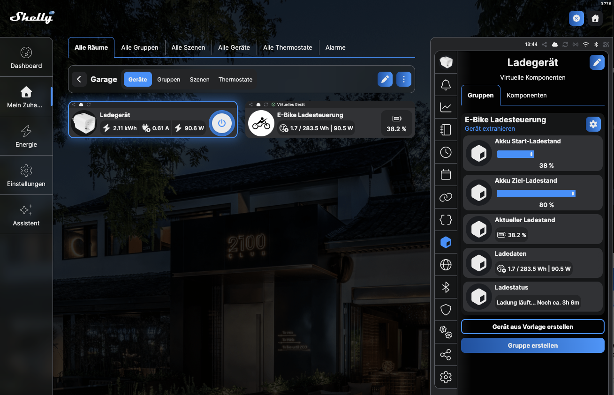

# Shelly Battery Charge Controller 🔋⚡

Eine intelligente Ladesteuerung für eBike-Akkus und andere Akkugeräte, optimiert für den **Shelly Plug M Gen3**. Das Skript überwacht den Ladevorgang in Echtzeit, schützt den Akku vor schädlicher Vollladung und schaltet das Ladegerät automatisch und sicher ab.

---

## 📖 Einführung & Warum dieses Skript wichtig ist

Die Lebensdauer moderner Lithium-Ionen-Akkus (wie sie in eBikes, Scootern oder Laptops zum Einsatz kommen) hängt maßgeblich von den Ladezyklen und dem Ladeverhalten ab. 

### Das Problem mit herkömmlichen Ladegeräten
Standard-Ladegeräte laden einen Akku stumpf bis zu seiner maximalen Kapazität ($100\%$) auf. Befindet sich ein Akku dauerhaft im Zustand maximaler Ladung (oder verbleibt er nach dem Laden stundenlang am Netz), entsteht im Inneren der Zellen ein hoher **chemischer Stress**. Dies beschleunigt die Zellalterung drastisch.

### Die Lösung: Akkuschonung durch gezielte Ladegrenzen
Wissenschaftliche Studien zeigen, dass ein Akku, der meistens nur bis **$80\%$ oder $85\%$** geladen wird, eine **zwei- bis dreimal längere Lebensdauer** (höhere Zyklenfestigkeit) aufweisen kann. 

Dieses Skript verwandelt deinen Shelly Plug M Gen3 in einen intelligenten Lade-Manager:
* **Präzise Abschaltung:** Es berechnet unter Einbeziehung von Ladeverlusten und dem Akkuzustand (Health/SoH) die exakte Energiemenge ($Wh$) und schaltet ab, sobald der gewünschte Ziel-Ladestand erreicht ist.
* **Dynamische Restzeitanzeige:** Du siehst jederzeit im Dashboard, wie lange die Ladung noch dauert.
* **Sicherheitsabschaltung (Auto-Off):** Fällt die Leistung des Ladegeräts am Ende der Ladung ab (Standby) oder wird der Akku getrennt, schaltet sich die Steckdose nach einer definierten Zeit automatisch ab, um Standby-Strom zu sparen und Brandgefahren zu minimieren.



---

## 📱 Voraussetzungen & Systemumgebung

Das System lässt sich vollständig über die **Shelly Smart Control App** steuern. Die App ist verfügbar für:
* 🤖 **Android** (Smartphone & Tablet)
* 🍏 **iOS / macOS** (iPhone, iPad & Mac über den App Store oder die Web-Oberfläche [control.shelly.cloud](https://control.shelly.cloud))

### Benötigte Komponenten auf dem Shelly:
Für die Bedienung müssen auf dem Shelly Plug M Gen3 folgende virtuelle Komponenten angelegt werden (die Steuerung erfolgt über die App):
1. **Zwei Slider (Schieberegler):** Für den Start-Ladestand (z. B. $20\%$) und den gewünschten Ziel-Ladestand (z. B. $80\%$).
2. **Drei Textfelder:** Zur Anzeige des aktuellen (geschätzten) Ladestands in $\%$, der bereits geladenen Energie ($Wh$/$W$) und des Ladestatus inklusive der berechneten **Restlaufzeit**.

---

## 🛠️ Installationsanleitung

### Schritt 1: Virtuelle Komponenten im Shelly anlegen
Bevor du das Skript startest, musst du die Bedienelemente in der Shelly App erstellen:

1. Öffne die **Shelly Smart Control App** oder das Web-Interface.
2. Navigiere zu deinem **Shelly Plug M Gen3**.
3. Gehe zu den Einstellungen und erstelle **Virtuelle Komponenten** (*Virtual Components*):
   * **Slider 1 (Start-Ladestand):** Typ `Number`, Wertebereich $0$ bis $100$ (Standard: $20$). Noteiere dir die ID (z. B. `number:200`).
   * **Slider 2 (Ziel-Ladestand):** Typ `Number`, Wertebereich $0$ bis $100$ (Standard: $80$). Notiere dir die ID (z. B. `number:201`).
   * **Textfeld 1 (Aktueller Ladestand):** Typ `Text`. ID notieren (z. B. `text:200`).
   * **Textfeld 2 (Ladedaten):** Typ `Text`. ID notieren (z. B. `text:201`).
   * **Textfeld 3 (Status & Restzeit):** Typ `Text`. ID notieren (z. B. `text:202`).

> ⚠️ **Wichtig:** Sollten deine IDs von den Standardwerten im Skript abweichen (`number:200`, `text:200`, etc.), musst du diese im Konfigurationsbereich des Skripts (`CONFIGURATION - SLIDER & TEXT IDs`) kurz anpassen.

### Schritt 2: Skript auf den Shelly übertragen
1. Kopiere den Code der `script.js` aus diesem Repository.
2. Gehe in der Shelly App beim Gerät auf den Menüpunkt **Scripts** und klicke auf **Add Script**.
3. Füge den Code in den Editor ein.
4. Benenne das Skript (z. B. `E-Bike Charge Control`).
5. Klicke auf **Save** (Speichern) und aktiviere den Schalter **Enable** (Autostart), damit das Skript nach einem Stromausfall oder Neustart des Shelly von alleine startet.

### Schritt 3: Skript-Konfiguration anpassen
Passe ganz oben im Skript die Werte an deinen eBike-Akku an:
```javascript
const LADEVERLUST_PROZENT = 20;  // Ladeverlust deines Netzteils (meist 15-20%)
const AKKU_KAPAZITAET_WH = 625;  // Kapazität deines Akkus in Wattstunden (z.B. 500, 625, 750)
const AKKU_ZUSTAND_PROZENT = 90; // Alterungszustand (State of Health) deines Akkus
